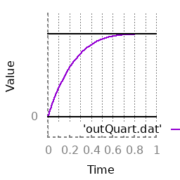

= Easing previews

These images are produced by simple functions that accept the current time, start value, amount of change when the animation ends, and animation lengths. They are Robert Penner's famous easing functions.

image::inOutQuart.png[inOutQuart function]

image::inOutCirc.png[inOutCirc function]

Ryan Juckett's damped springs code is also available:

